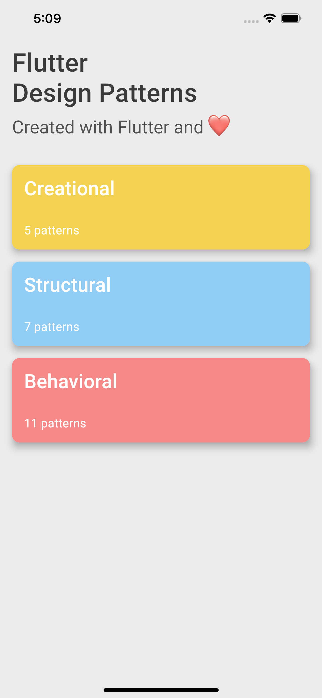
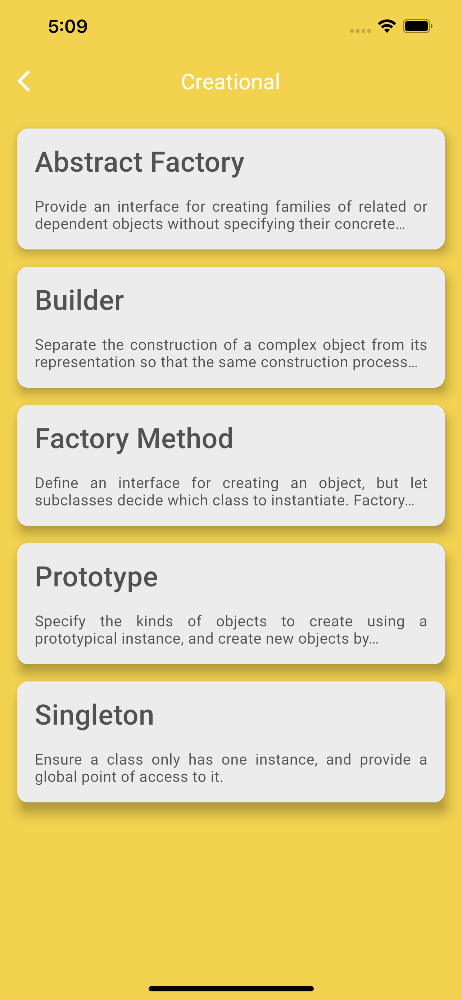
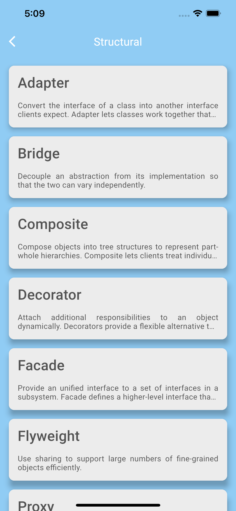
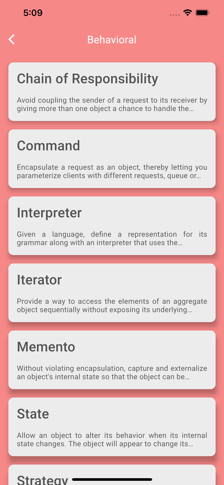
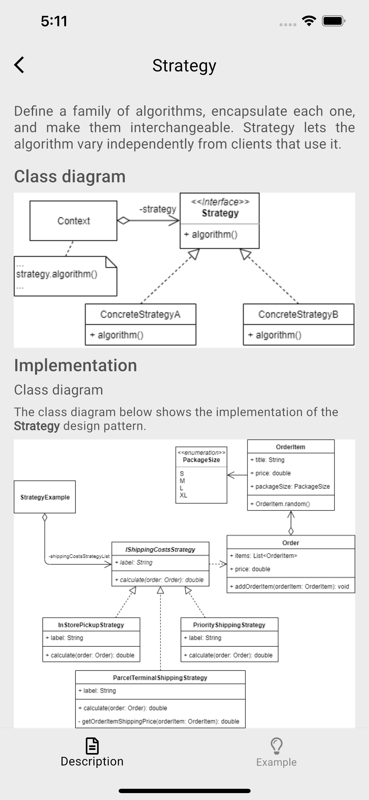
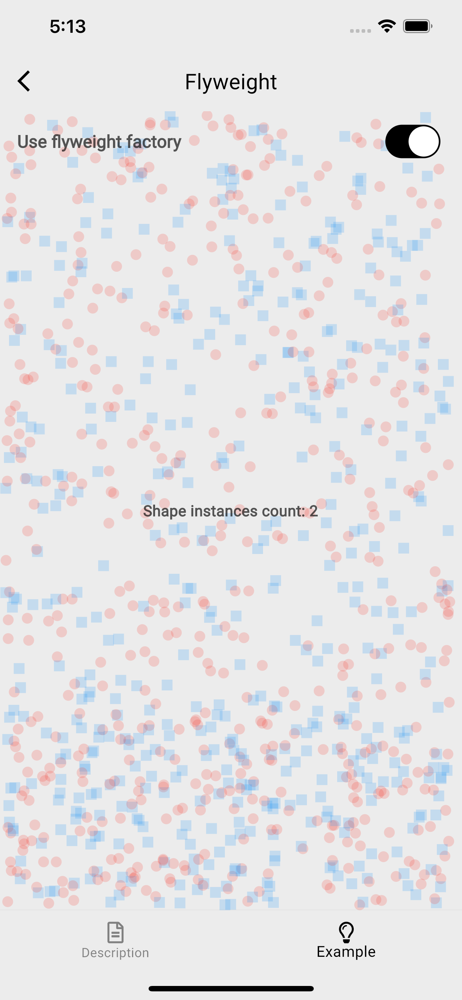
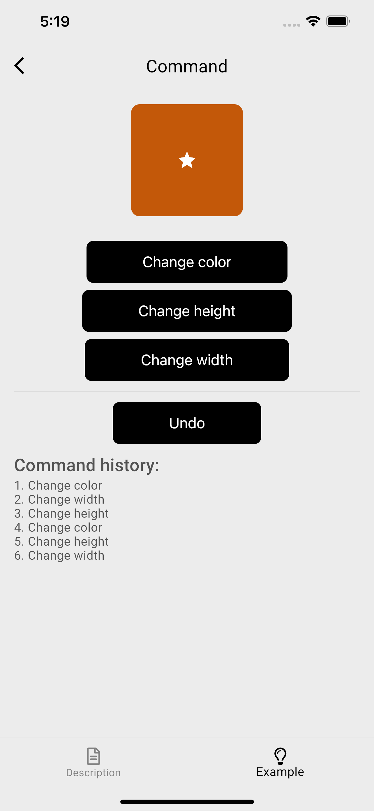
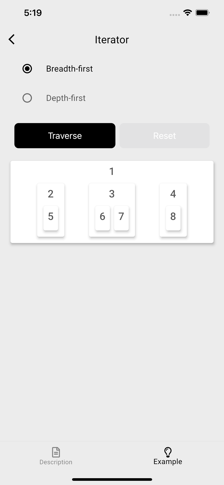
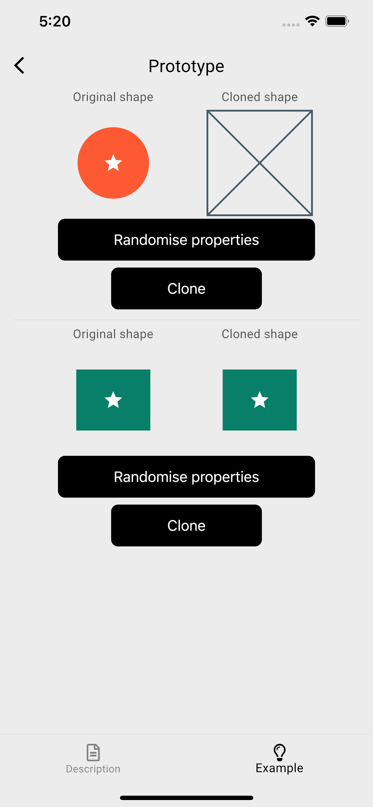

# Flutter Design Patterns

An open-source [OOP design patterns](https://en.wikipedia.org/wiki/Design_Patterns) application built with Dart and Flutter.

https://flutterdesignpatterns.com/

This application is an implementation part of the "Flutter Design Patterns" article series on [Medium](https://mkobuolys.medium.com/list/flutter-design-patterns-9804e6a0c3f4).

<p float="left">
	
	
	
	
    
	
	
	
	
</p>

## Building

You can follow these instructions to build the app and install it onto your device.

### Prerequisites

If you are new to Flutter, please first follow the [Flutter Setup](https://flutter.dev/setup/) guide.

### Building and installing the Flutter Design Patterns app

```
git clone https://github.com/mkobuolys/flutter-design-patterns.git
cd flutter-design-patterns
flutter pub get
flutter pub run build_runner build --delete-conflicting-outputs
flutter run
```

The `flutter run` command both builds and installs the Flutter app to your device or emulator.
